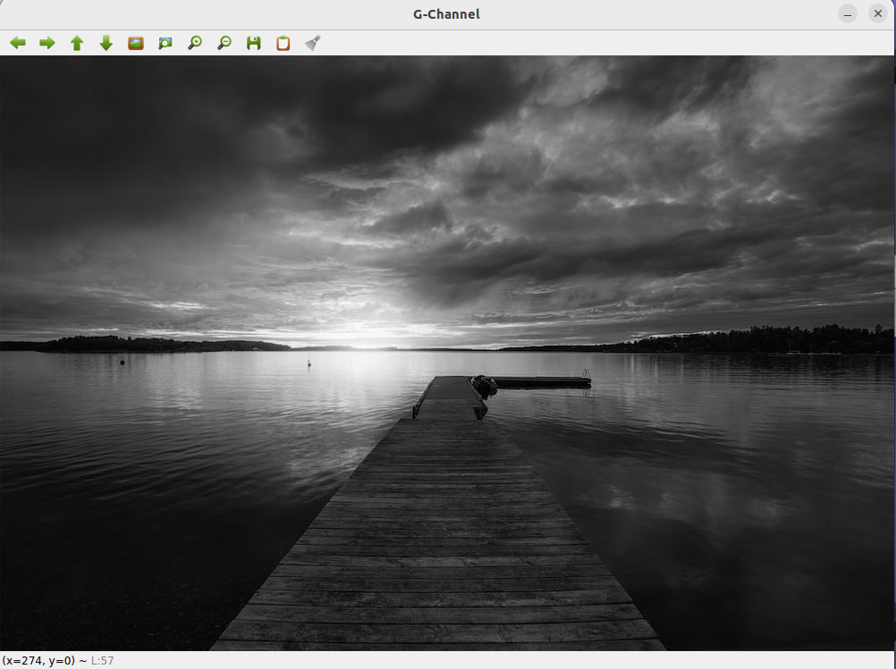
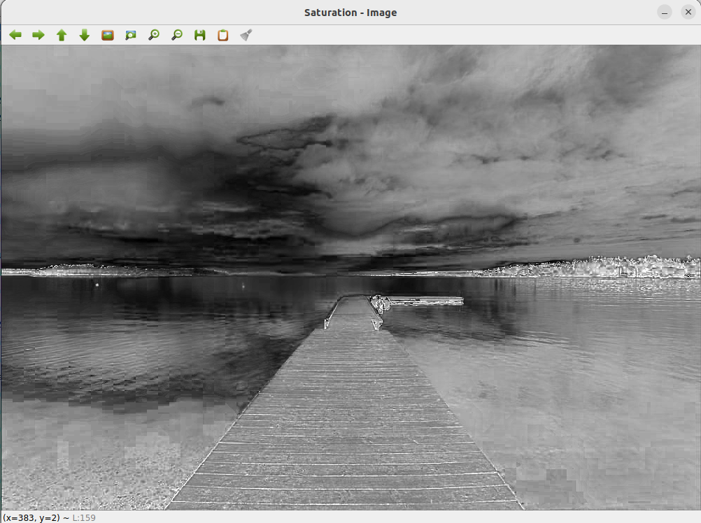

# COLOR-CONVERSION
## AIM
To perform the color conversion between RGB, BGR, HSV, and YCbCr color models.

## Software Required:
Anaconda - Python 3.7

## Algorithm:
### Step1:
Import opencv.
<br>

### Step2:
Read the original Image.
<br>

### Step3:
Store the required conversion of the image in a variable.
<br>

### Step4:
Show the image stored in the given variable.
<br>

### Step5:
Destroy all the windows and end the program.
<br>

## Program:
Developed By: Sneha Basyal M

Register Number: 212222240101

# i) Convert BGR and RGB to HSV and GRAY
```
import cv2
houseImage = cv2.imread('dip.jpeg')
cv2.imshow('Original Image',houseImage)
hsvImage = cv2.cvtColor(houseImage,cv2.COLOR_BGR2HSV)
cv2.imshow('BGR2HSV',hsvImage)
hsvImage1=cv2.cvtColor(houseImage,cv2.COLOR_RGB2HSV)
cv2.imshow('RGB2HSV',hsvImage1)
grayImage = cv2.cvtColor(houseImage,cv2.COLOR_BGR2GRAY)
cv2.imshow('BGR2GRAY',grayImage)
grayImage1 = cv2.cvtColor(houseImage,cv2.COLOR_RGB2GRAY)
cv2.imshow('RGB2GRAY',grayImage1)
cv2.waitKey(0)
cv2.destroyAllWindows()
```
# ii)Convert HSV to RGB and BGR
```
import cv2
houseHSVImage = cv2.imread('dip.jpeg')
cv2.imshow('Original HSV Image',houseHSVImage)
RGBImage = cv2.cvtColor(houseHSVImage,cv2.COLOR_HSV2RGB)
cv2.imshow('BGR2HSV',RGBImage)
BGRImage=cv2.cvtColor(houseHSVImage,cv2.COLOR_HSV2BGR)
cv2.imshow('RGB2HSV',BGRImage)
cv2.waitKey(0)
cv2.destroyAllWindows()
```
# iii)Convert RGB and BGR to YCrCb
```
import cv2
houseImage = cv2.imread('dip.jpeg')
cv2.imshow('Original HSV Image',houseImage)
YCrCb_image = cv2.cvtColor(houseImage, cv2.COLOR_RGB2YCrCb)
cv2.imshow('BGR2HSV',YCrCb_image)
YCrCb_image1 = cv2.cvtColor(houseImage, cv2.COLOR_BGR2YCrCb)
cv2.imshow('RGB2HSV',YCrCb_image1)
cv2.waitKey(0)
cv2.destroyAllWindows()
```
# iv)Split and Merge RGB Image
```
import cv2
image = cv2.imread('dip.jpeg')
blue = image[:,:,0]
green = image[:,:,1]
red = image[:,:,2]
cv2.imshow('B-Channel',blue)
cv2.imshow('G-Channel',green)
cv2.imshow('R-Channel',red)
mergeBgr = cv2.merge((blue,green,red))
cv2.imshow('Merged BGR image',mergeBgr)
cv2.waitKey(0)
cv2.destroyAllWindows()
```
# v) Split and merge HSV Image
```
import cv2
image = cv2.imread('dip.jpeg')
hsv = cv2.cvtColor(image,cv2.COLOR_BGR2HSV)
h,s,v = cv2.split(hsv)
cv2.imshow('Hue - Image',h)
cv2.imshow('Saturation - Image',s)
cv2.imshow('Gray - Image',v)
mergedHSV = cv2.merge((h,s,v))
cv2.imshow('Merged HSV Image',mergedHSV)
cv2.waitKey(0)
cv2.destroyAllWindow
```
## Output:
### i) BGR and RGB to HSV and GRAY


<br>
<br>

### ii) HSV to RGB and BGR


<br>
<br>

### iii) RGB and BGR to YCrCb


<br>
<br>

### iv) Split and merge RGB Image




<br>
<br>

### v) Split and merge HSV Image




<br>
<br>

## Result:
Thus the color conversion was performed between RGB, HSV and YCbCr color models.
